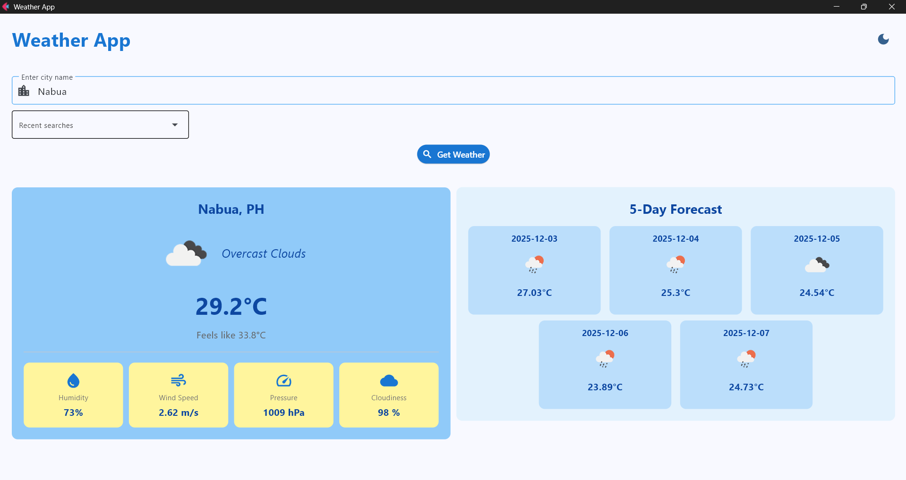
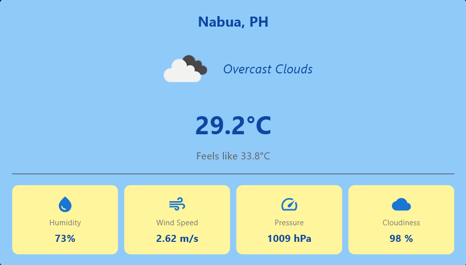
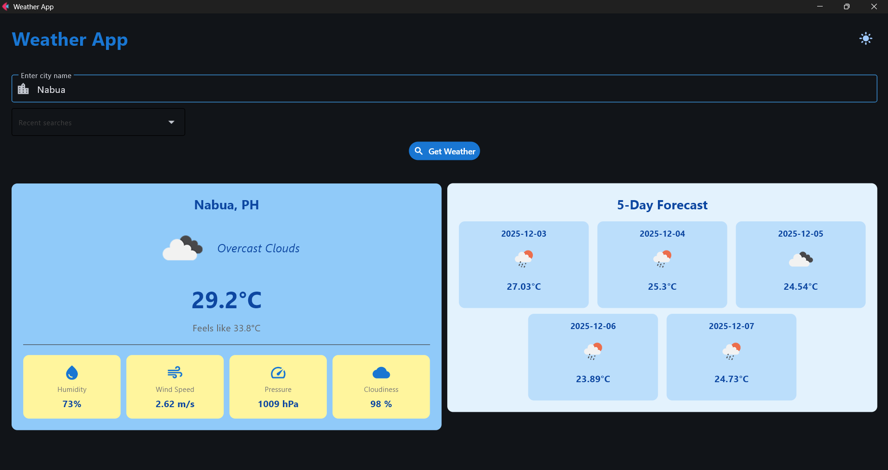
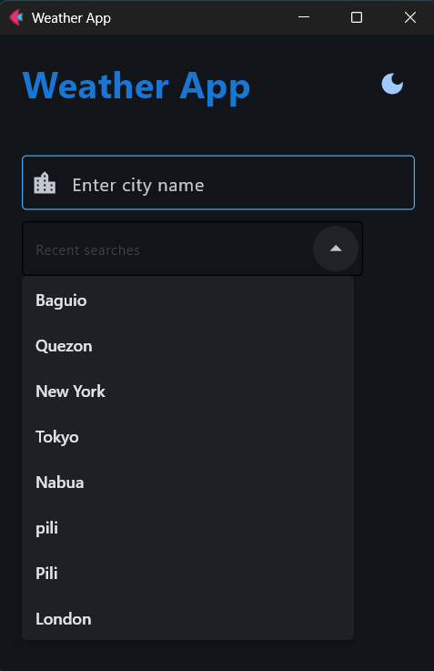
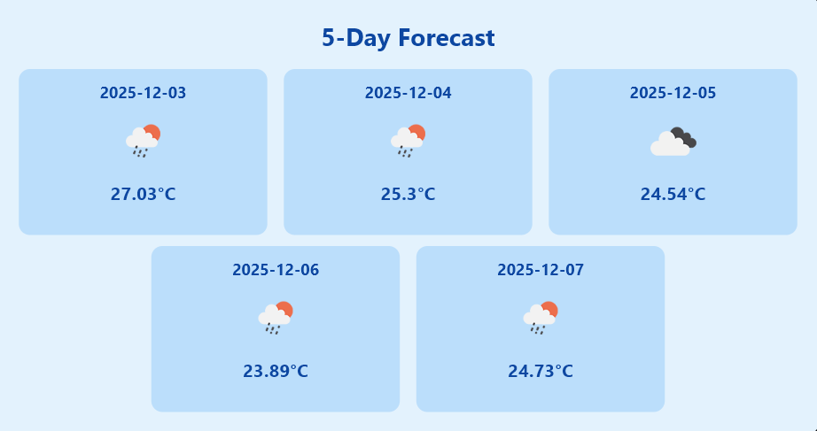
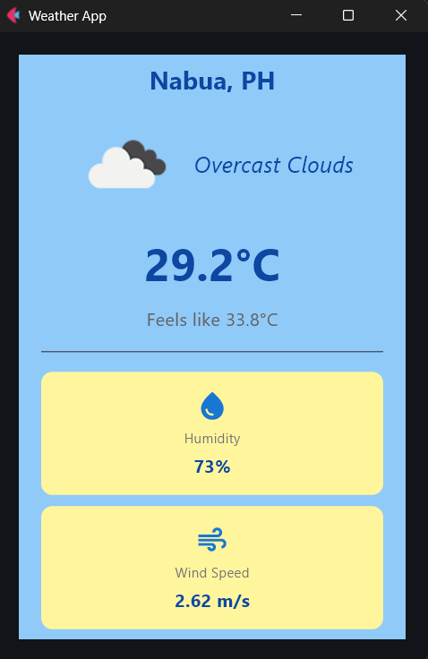

# Module 6 Report: Weather Application

**Student Name:** Ivy Pauline Muit\
**Student ID:** 231002279\
**Section:** BSCS 3A\
**Course:** CCS 106 - Application Development and Emerging Technologies
**Date:** 12/03/2025

## Git Configuration

### Repository Setup
- **GitHub Repository:** [(https://github.com/pau-827/cccs106-projects)]
- **Local Repository:** ✅ Initialized and connected
- **Commit History:** [12] commits with descriptive messages

### Git Skills Demonstrated
- ✅ Adding, committing, and pushing changes
- ✅ Managing untracked files and folder structures

## Project Overview
This is a Weather Application built using Flet v0.28.3, integrating real-time weather data from the OpenWeatherMap REST API.
It enables the user to look up any city, instantly displaying the current conditions, temperatures, humidity, wind speed, cloudiness, and weather icons.

The app also provides additional features, like a search history system, a 5-day forecast, and theme toggle between light and dark. All API operations are asynchronous and use `page.run_task()` for smooth UI responsiveness.

## Features Implemented

### Base Features
- ✅ City search functionality
- ✅ Display of current temperature
- ✅  Weather description + weather icons
- ✅  Humidity, wind speed, pressure, cloudiness
- ✅  Error handling for invalid cities or network issues
- ✅  Modern UI using Material-like design
- ✅  Proper async/await using page.run_task()

### Enhanced Features

#### 1. Light/Dark Theme Toggle (Custom Enhancement)
An easy-to-access theme button switches between light and dark modes (page.theme_mode). I chose this feature to improve user comfort, especially at night, and follows modern UI patterns. Initially, the icon didn’t change when switching themes, but this is solved by updating the button icon inside the `toggle_theme()` function.

#### 2. Search History (Beginner Level)
The app saves the last 10 searched cities in a `search_history.json` file. These cities appear in a dropdown, allowing the user to quickly re-search them. I chose this feature because it improves usability and reduces repetitive typing when checking the same city multiple times. At first, dropdown wasn’t updating after a new search. Hence, I rebuilt dropdown options dynamically after saving history and called `page.update()`.

#### 3. 5-Day Weather Forecast (Medium Level)
Displays a responsive row of forecast cards (weather icon + temperature + date) using OpenWeatherMap’s /forecast endpoint. One reading every 24 hours is shown. I chose this feature because a forecast gives users more relevant information for planning beyond just today’s weather. Layout broke on small screens at first, that's why I wrapped items in ResponsiveRow with column settings.

## Screenshots

### 1. Main Weather App Interface (Light Mode)

### 2. Shows Current Weather

### 3. Dark Mode Toggle

### 4. Search History Function

### 5. 5-Day Weather Forecast

### 6. Resposive UI for Mobile interface
