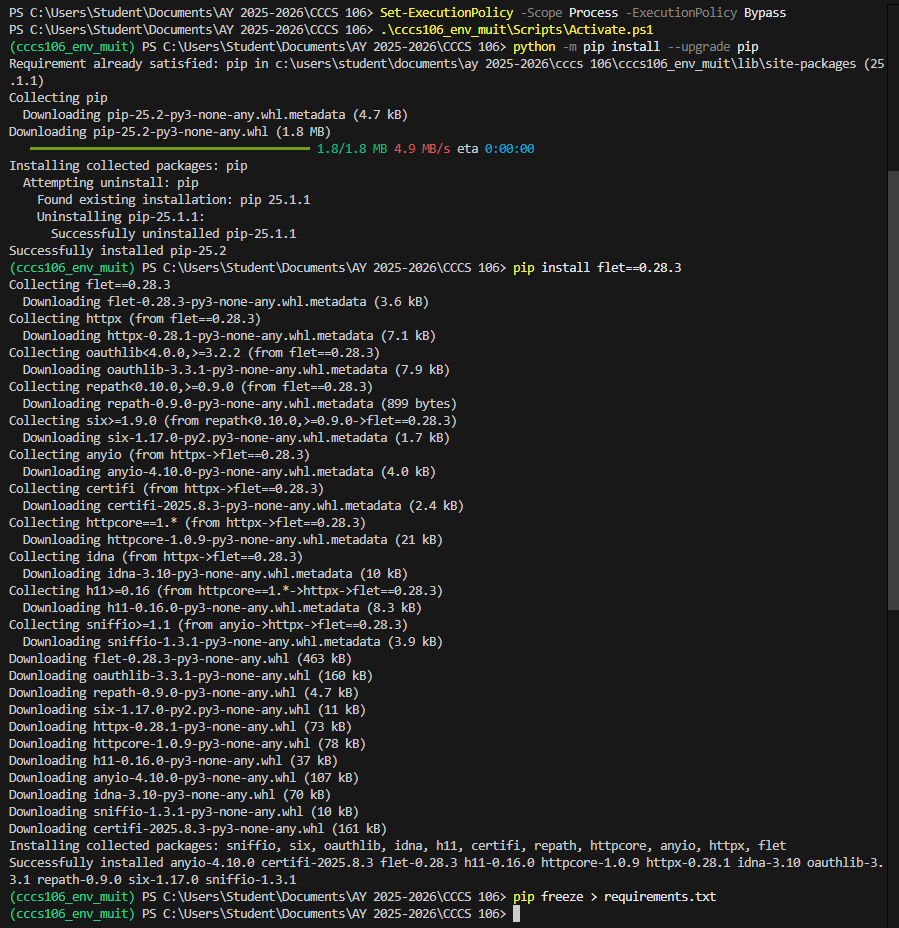
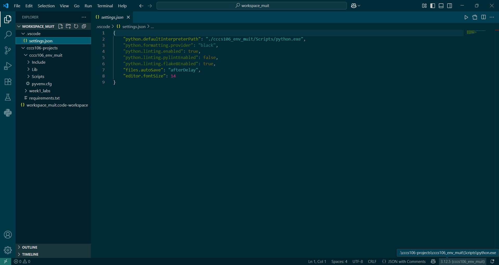
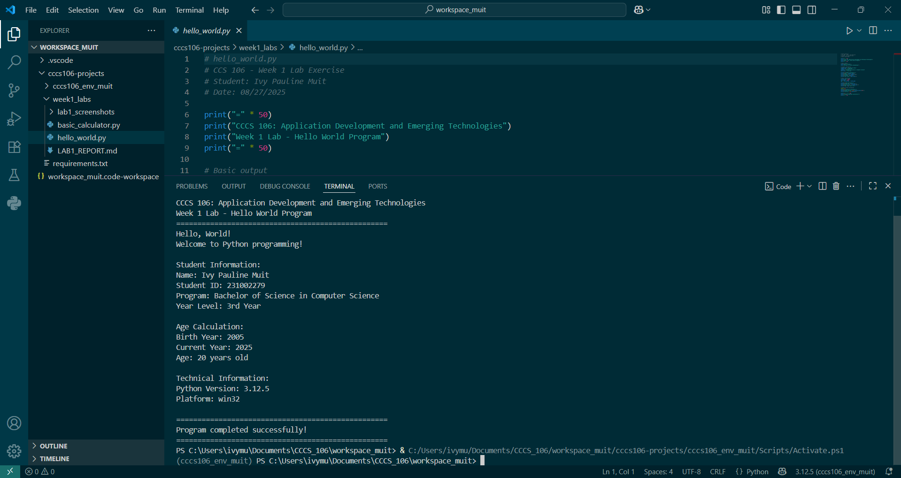
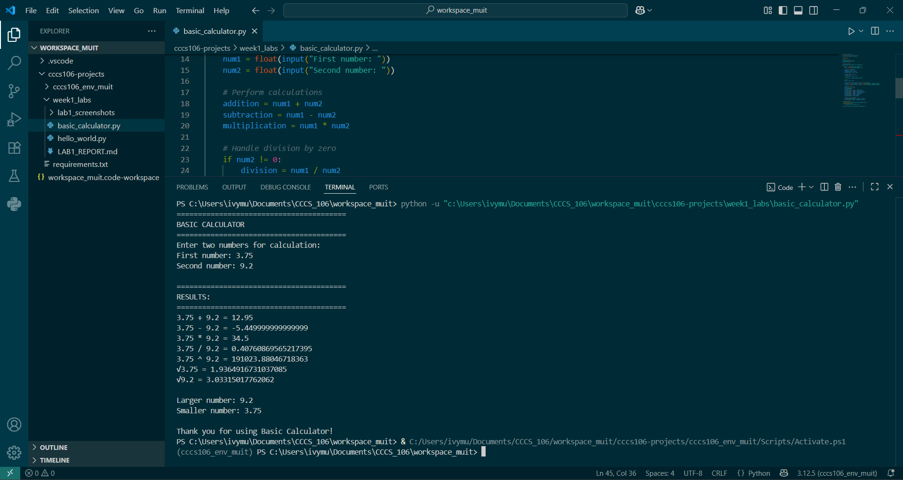

# Lab 1 Report: Environment Setup and Python Basics

**Student Name:** Ivy Pauline Muit\
**Student ID:** 231002279\
**Section:** BSCS 3A\
**Date:** 08/27/2025

## Environment Setup

### Python Installation
- **Python Version:** Python 3.13.5
- **Installation Issues:** While setting up and activating my virtual environment, I encountered a restriction due to PowerShell blocking script execution. Hence, I temporarily changed the execution policy to allow script execution.
- **Virtual Environment Created:** ✅ cccs106_env_muit

### VS Code Configuration
- **VS Code Version:** 1.103
- **Python Extension:** ✅ Installed and configured
- **Interpreter:** ✅ Set to cccs106_env_muit/Scripts/python.exe

### Package Installation
- **Flet Version:** 0.28.3
- **Other Packages:**
  - anyio==4.10.0
  - certifi==2025.8.3
  - h11==0.16.0
  - httpcore==1.0.9
  - httpx==0.28.1
  - idna==3.10
  - oauthlib==3.3.1
  - repath==0.9.0
  - six==1.17.0
  - sniffio==1.3.1
  - typing_extensions==4.15.0

## Programs Created

### 1. hello_world.py
- **Status:** ✅ Completed
- **Features:** Student info display, age calculation, system info
- **Notes:** None

### 2. basic_calculator.py
- **Status:** ✅ Completed
- **Features:** Basic arithmetic, error handling, min/max calculation
- **Notes:** None

## Challenges and Solutions

Aside from the restriction upon activation of my virtual environment, the only other issues I encountered or a step I got confused with is about the workspace setup. I saved my program files into the .vscode which was supposed to be saved in a different folder inside the workspace folder (week1_labs). To add, it's my first time using the markdown feature and I needed to search up how to add screenshots in it.

## Learning Outcomes

One might think that even without these setups, you are still able to code programs, and that is true. However, these extra steps, I believe, gives more advantage in a long run, because it will make doing projects more secured, effecient, and organized.

## Screenshots

### 1. Virtual Environment Setup (Screenshot from Lab hours, but jut the same with the redo setup I did at home)

### 2. VS Code Setup

### 3. Hello World Output

### 4. Basic Calculator Output (Enhanced with Power and Square Root included)
