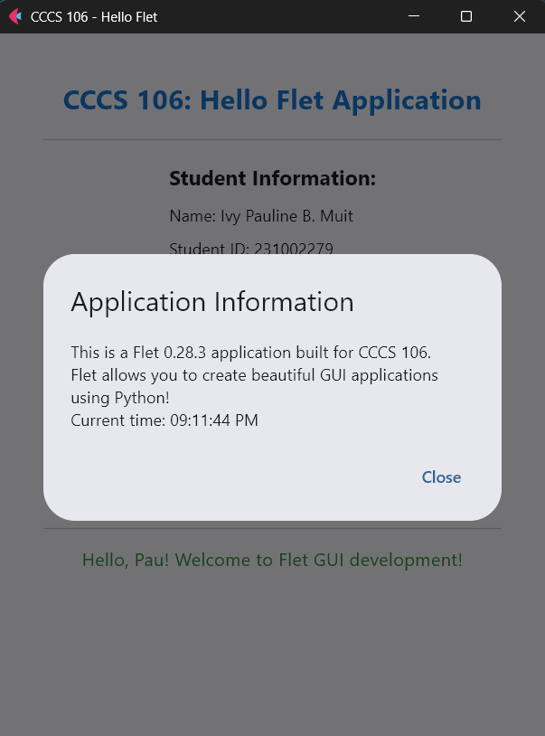
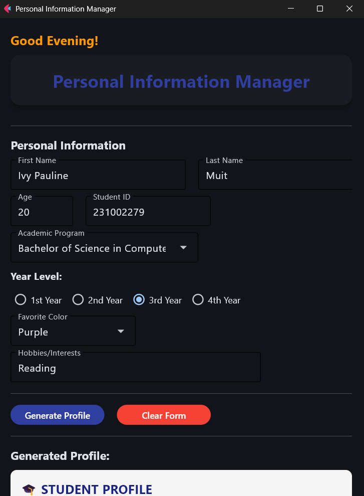

# Lab 2 Report: Git Version Control and Flet GUI Development

**Student Name:** Ivy Pauline B. Muit\
**Student ID:** 231002279\
**Section:** BSCS 3A\
**Date:** 09/03/2025

## Git Configuration

### Repository Setup
- **GitHub Repository:** [(https://github.com/pau-827/cccs106-projects)]
- **Local Repository:** ✅ Initialized and connected
- **Commit History:** [8] commits with descriptive messages

### Git Skills Demonstrated
- ✅ Repository initialization and configuration
- ✅ Adding, committing, and pushing changes
- ✅ Branch creation and merging
- ✅ Remote repository management

## Flet GUI Applications

### 1. hello_flet.py
- **Status:** ✅ Completed
- **Features:** Interactive greeting, student info display, dialog boxes
- **UI Components:** Text, TextField, Buttons, Dialog, Containers
- **Notes:** None

### 2. personal_info_gui.py
- **Status:** ✅ Completed
- **Features:** Form inputs, dropdowns, radio buttons, profile generation
- **UI Components:** TextField, Dropdown, RadioGroup, Containers, Scrolling
- **Error Handling:** Input validation and user feedback
- **Notes:** None

## Technical Skills Developed

### Git Version Control
- Understanding of repository concepts
- Basic Git workflow (add, commit, push)
- Branch management and merging
- Remote repository collaboration

### Flet GUI Development
- Flet 0.28.3 syntax and components
- Page configuration and layout management
- Event handling and user interaction
- Modern UI design principles

## Challenges and Solutions

My time was mostly consumed by figuring out why I couldn’t push my Week 1 activities to GitHub. I later realized I was working in the wrong directory, and once I corrected it, the workflow became much smoother. Through this, I learned the importance of carefully checking my setup when using Git. I also gained hands-on experience with GUI development using Flet and understood how collaborative programming benefits from version control, clear commit messages, and proper branching.

## Learning Outcomes

Through this exercise, I learned how version control with Git helps keep projects organized, track changes, and manage different branches for new features. I also gained hands-on experience in developing simple GUI applications with Flet, which made my programs more interactive and user-friendly. Finally, I understood how collaborative programming benefits from clear commit messages, proper branching, and documentation, making teamwork smoother and more efficient.

## Screenshots

### 1. Hello Flet

### 2. Personal Info GUI (Enhanced)
- Added dynamic greeting
- Adjusted title design
- Added hover effect and tooltips on buttons

### Git Repository
- [ ] GitHub repository with commit history
- [ ] Local git log showing commits

### GUI Applications
- [ ] hello_flet.py running with all features
- [ ] personal_info_gui.py with filled form and generated profile

## Future Enhancements

I plan to improve the applications by adding more interactive features, such as a fully functional enhanced calculator with history tracking and error handling. I also want to enhance the personal information manager with data storage options and better UI design for a smoother user experience.