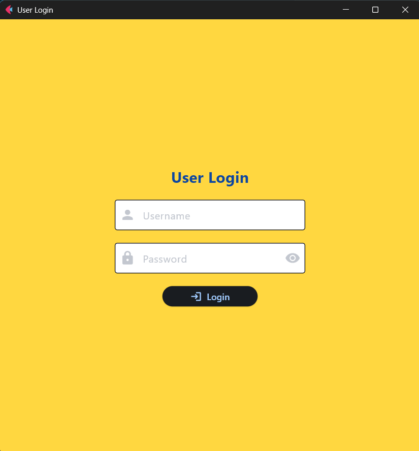
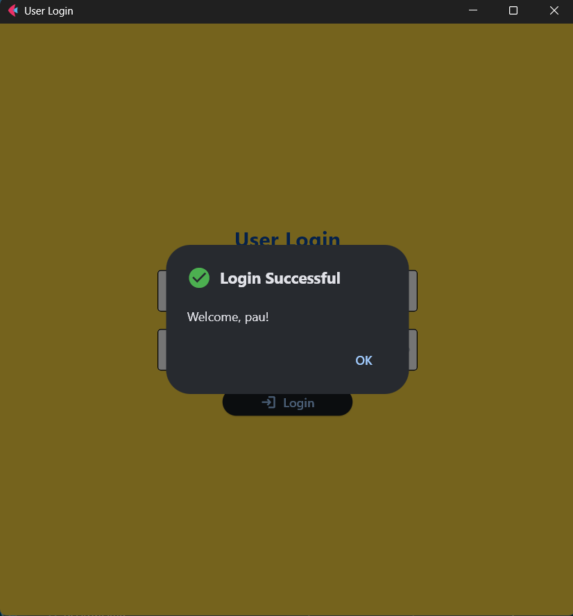
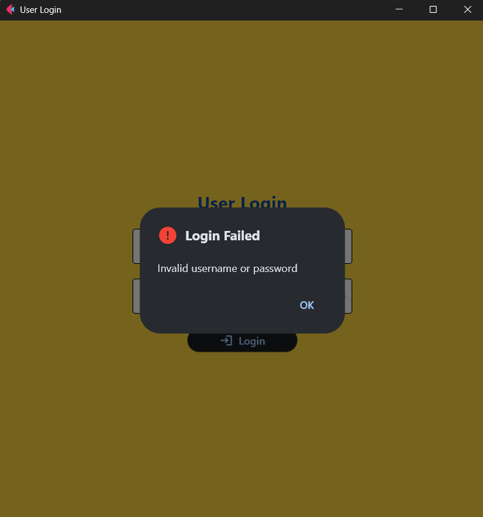
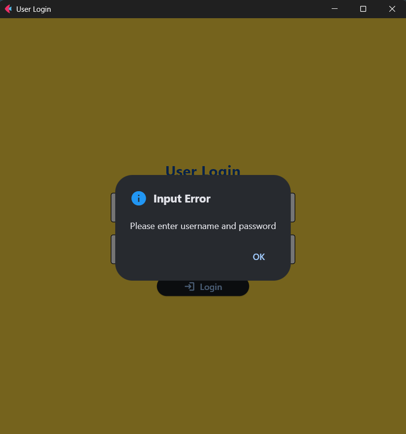

# Lab 3 Report: User Login with Flet and MySQL 

**Student Name:** Ivy Pauline Muit\
**Student ID:** 231002279\
**Section:** BSCS 3A\
**Date:** 10/01/2025

## Git Configuration

### Repository Setup
- **GitHub Repository:** [(https://github.com/pau-827/cccs106-projects)]
- **Local Repository:** ✅ Initialized and connected
- **Commit History:** [10] commits with descriptive messages

### Git Skills Demonstrated
- ✅ Adding, committing, and pushing changes
- ✅ Managing untracked files and folder structures

## Database Setup

### Database Creation
- **Database Name:** fletapp
- **Table:** users with fields: id, username, password
- **Sample Data Inserted:**
    - **Username:** pau
    - **Password:** 404NotFound

## Database Skills Demonstrated
- ✅ Database and table creation in MySQL Workbench
- ✅ Data insertion and retrieval testing

## Flet Applictaion

### Application: main.py
- **Status:** ✅ Completed
- **Features:**
    - Login UI with username and password fields
    - Login Validation against MySQL database
    - Dialog boxes for success, failure, and database error

### Supporting File: db_connection.py
- **Status:** ✅ Completed
- **Features:** Handles MySQL connection with credentials and database selection

## Technical Skills Developed
- Git Workflow
- Flet GUI Development
- Database Management

## Challenges and Solutions

At first, I encountered an issue with Git when I accidentally pushed empty folders to my repository because I hadn’t actually added any files. I fixed this by committing the actual code files, which allowed me to push properly. I also ran into a problem with Flet icons, since my version only supported ft.Icons and not ft.icons. This was solved by adjusting my syntax to match the correct version. Another challenge I faced was with the dialogs: my initial implementation caused the program to crash because the AlertDialog had no default values. I resolved this by initializing the dialog with safe defaults and then updating its content dynamically when needed.

## Learning Outcomes

Through this lab, I was able to build a functional login system by combining Flet with MySQL, which gave me hands-on experience in integrating a GUI with a database. I also learned how to apply simple UI design principles, such as using colors and text styling, to make the interface more readable and user-friendly. At the same time, I became more confident in managing my Git repository, especially after learning to avoid mistakes like empty commits and making sure I track the right files before pushing.

## Screenshots

### 1. User Login UI

### 2. Successful Login Dialog

### 3. Failed Login Dialog

### 4. No Input

### 5. Database Error
Unavailable, as I encountered no instance where it cannot connect to the database.

## Future Enhancements

This project can be enhanced by adding a user registration feature with proper input validation so that new accounts can be created directly through the application. I also want to improve security by encrypting passwords instead of storing them in plain text, which is an important practice for real-world systems. Lastly, I would like to expand the interface by adding navigation to a dedicated “Home Page” after a successful login, making the application feel more complete and closer to a real user management system.