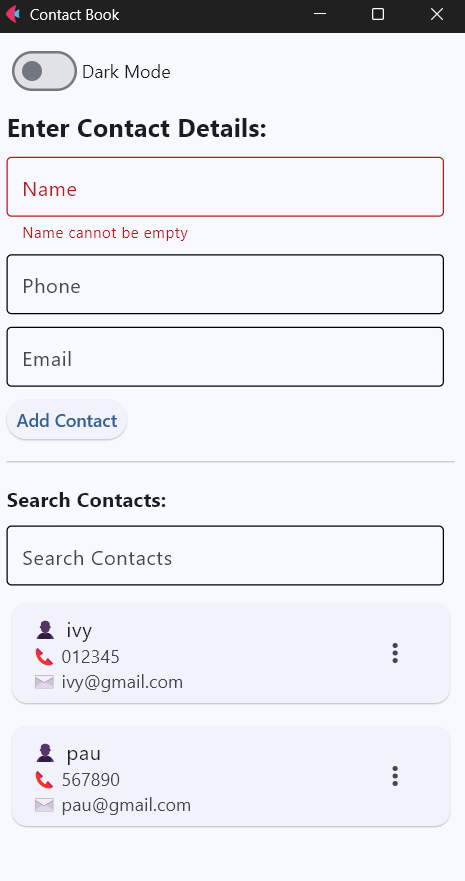
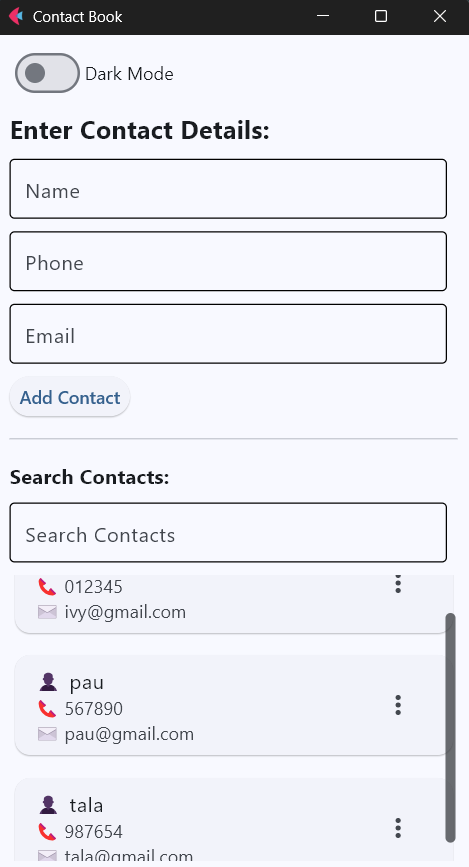
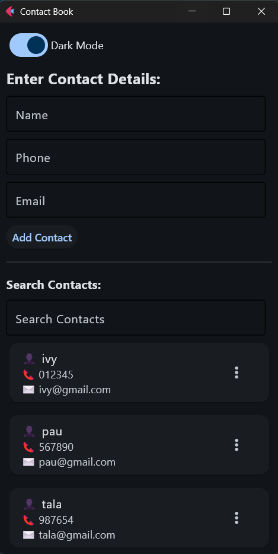
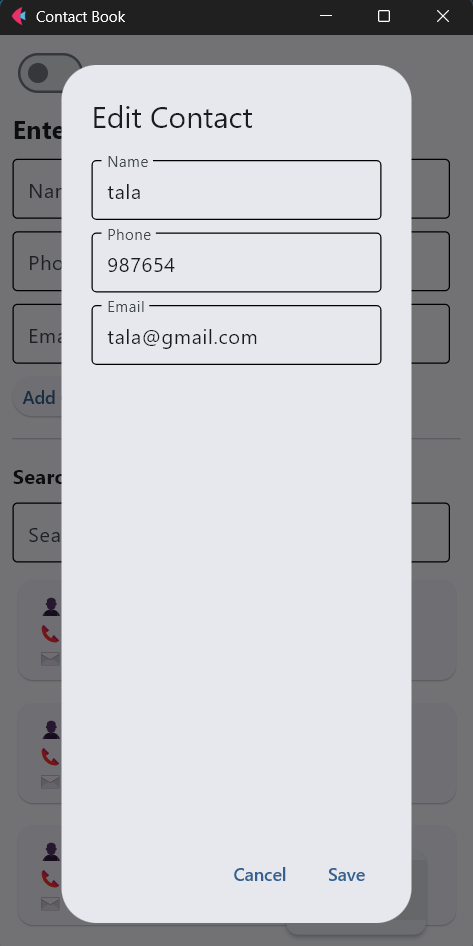
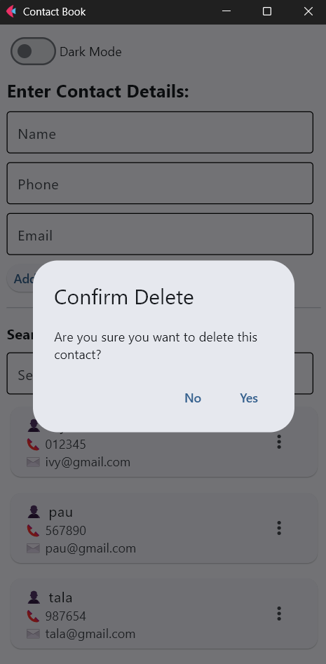

# Lab 4 Report: Contact Book Application Enhancement

**Student Name:** Ivy Pauline Muit\
**Student ID:** 231002279\
**Section:** BSCS 3A\
**Date:** 10/01/2025

## Git Configuration

### Repository Setup
- **GitHub Repository:** [(https://github.com/pau-827/cccs106-projects)]
- **Local Repository:** ✅ Initialized and connected
- **Commit History:** [13] commits with descriptive messages

### Git Skills Demonstrated
- ✅ Adding, committing, and pushing changes
- ✅ Managing untracked files and folder structures

## Database Setup

### Database Creation
- **Database Name:** contacts.db
- **Table:** users with fields: id, name, phone, email
- **Database Operations Implemented:**
    - Add New Contact
    - Update Existing Contact
    - Delete Contact
    - Search/Filter Contact by Name

## Database Skills Demonstrated
- ✅ Database initialization and table creation using SQLite
- ✅ CRUD Operations
- ✅ Using SQL `LIKE` clause for search functionality

## Flet Applictaion

### Application: main.py
- **Status:** ✅ Completed
- **Features:**
    - Enter Contact Details section (static) with `TextFields` for Name, Phone, Email
    - Add Contact button with input validation for name
    - Scrollable Contacts section with ListView inside a Column
    - Search bar with real-time filtering
    - Dark Mode toggle
    - Modern contact display using ft.Card with icons and emojis
    - Edit/Delete options with confirmation dialogs
    - Separate scroll for contacts and inputs

### Supporting Files:
- db_connection.py
    - Handles all database interactions: add, update, delete, retrieve contacts
- app_logic.py
    - Connects UI interactions to database functions
    - Implements `display_contacts`, `add_contact`, `delete_contact`, `open_edit_dialog`

## Technical Skills Developed
- Git workflow
- Flet GUI development with modern UI components
- SQLite database management and real-time search functionality
- Handling UI/UX enhancements like dark mode and scrollable content
- Input validation and confirmation dialogs

## Challenges and Solutions

During development, I faced several challenges. The search function initially didn’t update correctly after making the contacts section scrollable, which was fixed by using e.control.value in the on_change event. Scroll behavior was also tricky, so I separated the input fields (static) from the contacts list (scrollable) to improve usability. I encountered Flet argument errors with scroll and padding, which I resolved by applying scrolling to the Column and using a Container for padding. Lastly, the edit and delete buttons disappeared at first, but this was fixed by correctly nesting the ListView inside the scrollable column while keeping the PopupMenuButton logic intact.

## Learning Outcomes

Through this activity, I learned how to build a dynamic and interactive contact management system using Flet, integrating database operations with the user interface to handle CRUD actions and real-time search. I improved my UI/UX skills by implementing scrollable content, cards, icons, and dark mode, while also reinforcing good practices in error handling and input validation.

## Screenshots

### 1. Enter Contact Details Section

### 2. Scrollable Contacts Section

### 3. Dark Mode Toggle

### 4. Edit Contact Dialog

### 5. Delete Contact Dialog

## Future Enhancements

For future enhancements, I plan to add user authentication to secure contacts data, improve the UI by grouping contacts into categories or favorites, implement export and import functionality, and expand the search feature to include phone numbers and email addresses in addition to names.